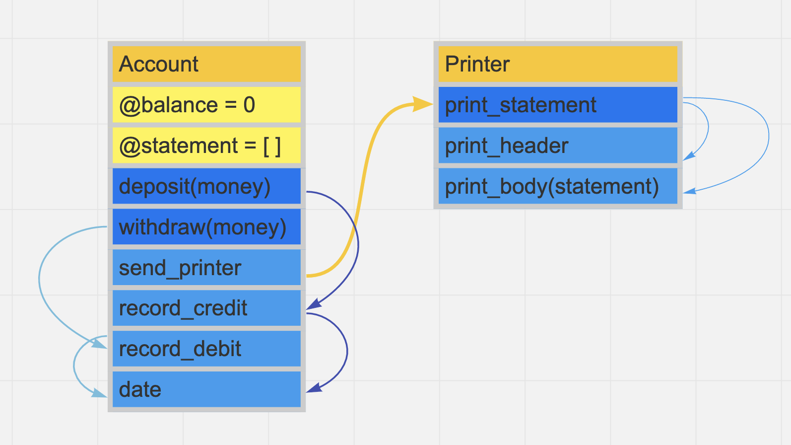
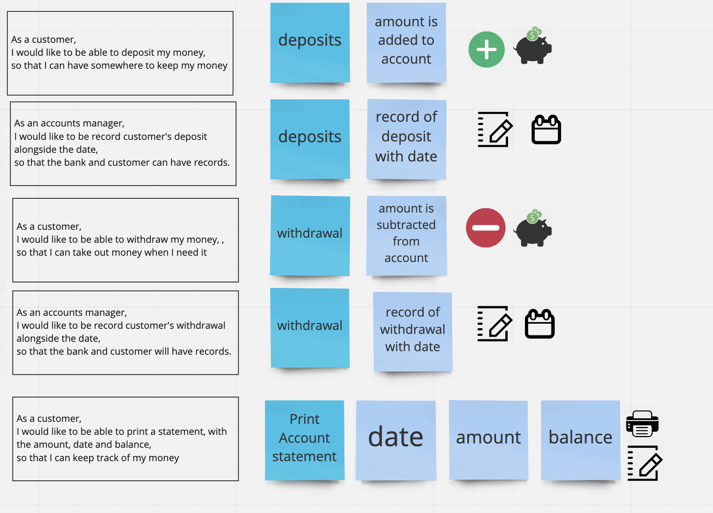
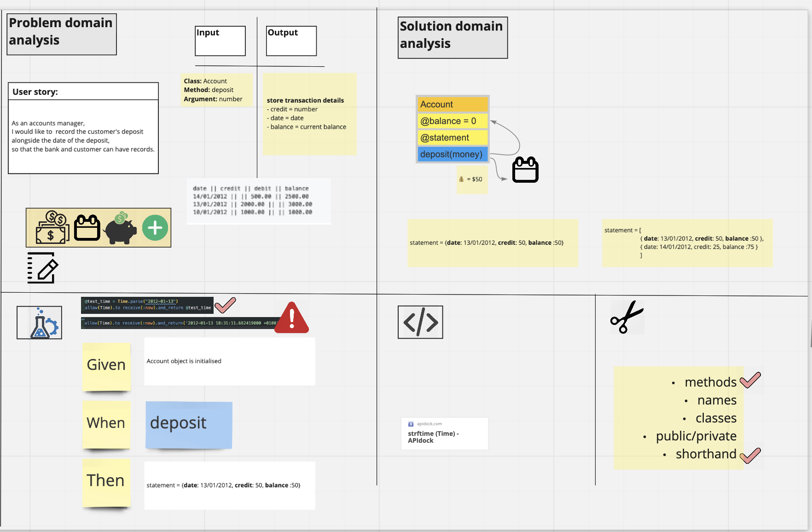

# Bank tech test

Today, you'll practice doing a tech test.

For most tech tests, you'll essentially have unlimited time. This practice session is about producing the best code you can when there is a minimal time pressure.

You'll get to practice your OO design and TDD skills.

You'll work alone, and you'll also review your own code so you can practice reflecting on and improving your own work.

## Specification

### Requirements

- You should be able to interact with your code via a REPL like IRB or the JavaScript console. (You don't need to implement a command line interface that takes input from STDIN.)
- Deposits, withdrawal.
- Account statement (date, amount, balance) printing.
- Data can be kept in memory (it doesn't need to be stored to a database or anything).

### Acceptance criteria

**Given** a client makes a deposit of 1000 on 10-01-2012  
**And** a deposit of 2000 on 13-01-2012  
**And** a withdrawal of 500 on 14-01-2012  
**When** she prints her bank statement  
**Then** she would see

```
date || credit || debit || balance
14/01/2012 || || 500.00 || 2500.00
13/01/2012 || 2000.00 || || 3000.00
10/01/2012 || 1000.00 || || 1000.00
```

## User stories 

```
As a customer,
I would like to be able to deposit my money,
so that I can have somewhere to keep my money
```

```
As an accounts manager,
I would like to be record customer's deposit  alongside the date,
so that the bank and customer can have records.
```

```
As a customer,
I would like to be able to withdraw my money, ,
so that I can take out money when I need it
```

```
As an accounts manager,
I would like to be record customer's withdrawal alongside the date,
so that the bank and customer will have records.
```

```As a customer,
I would like to be able to print a statement, which includes the amount, date and balance,
so that I can keep track of my money
```


## Main Technologies

run `bundle install`

| Purpose          | Technology |
| ---------------- | ---------- |
| Language         | Ruby       |
| Testing          | RSpec      |
| Testing Coverage | SimpleCov  |

## Getting Started

if you are using ssh:
`git clone git@github.com:Gina-Frankel/bank_tech_tests.git`

If you are using https:
`git clone https://github.com/Gina-Frankel/bank_tech_tests.git`

Depedencies:
`bundle install`

## Running Tests

Run `rspec` in terminal


## Running App

```
2.5.7 :001 > require './lib/account.rb'
 => true 
2.5.7 :002 > account = Account.new
 => #<Account:0x00007f8f0284f3d0 @balance=0, @statement=[]> 
2.5.7 :003 > account.deposit(50)
 => [{:credit=>50, :balance=>50, :date=>"19/05/2020"}] 
2.5.7 :004 > account.deposit(100)
 => [{:credit=>50, :balance=>50, :date=>"19/05/2020"}, {:credit=>100, :balance=>150, :date=>"19/05/2020"}] 
2.5.7 :005 > account.withdraw(30)
 => [{:credit=>50, :balance=>50, :date=>"19/05/2020"}, {:credit=>100, :balance=>150, :date=>"19/05/2020"}, {:debit=>30, :balance=>120, :date=>"19/05/2020"}] 
2.5.7 :006 > account.send_printer
date || credit || debit || balance
19/05/2020 ||  || 30 || 120
19/05/2020 || 100 ||  || 150
19/05/2020 || 50 ||  || 50
 => [{:debit=>30, :balance=>120, :date=>"19/05/2020"}, {:credit=>100, :balance=>150, :date=>"19/05/2020"}, {:credit=>50, :balance=>50, :date=>"19/05/2020"}] 
 ```


## Code Structure 


- The code consists of two classes Account & printer 
- The Account class enables a customer to deposit or withdraw money
  - If the customer makes a deposit the money is added from @balance
  - If the customers withdraws money the money is deducted from @balance
- The deposit and withdraw methods are linked respectively to the record_credit and the record_debit methods.
  - These methods push a hash with information about the transaction into the @statement array 
- The send_printer method then allows the customer to print @statement by accessing the Printer Class 
- The  Printer Class has 3 methods
  - print_statement  which runs the print functionality 
  - print_statement is linked ot print_header, which prints the header of the statement  
  - print_statement is also linked ot print_body, which iterates through the @statement array, and prints out the hash values inside @statement


## Design approach 

The first part of my process was creating user stories from the requirements




This is an example of my approach to designing the solution to a user story

## Self-assessment

Once you have completed the challenge and feel happy with your solution, here's a form to help you reflect on the quality of your code: https://docs.google.com/forms/d/1Q-NnqVObbGLDHxlvbUfeAC7yBCf3eCjTmz6GOqC9Aeo/edit
