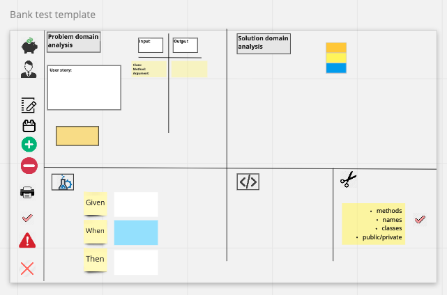

# Bank

This is a small project. The aim is to practice code quality.

The bank enables you to create an account, deposit and withdraw funds and print statements.

## Spec

### Requirements

- You should be able to interact with your code via a REPL like IRB or the JavaScript console. (You don't need to implement a command line interface that takes input from STDIN.)
- Deposits, withdrawal.
- Account statement (date, amount, balance) printing.
- Data can be kept in memory (it doesn't need to be stored to a database or anything).

### Acceptance criteria

**Given** a client makes a deposit of 1000 on 10-01-2012  
**And** a deposit of 2000 on 13-01-2012  
**And** a withdrawal of 500 on 14-01-2012  
**When** she prints her bank statement  
**Then** she would see

```
date || credit || debit || balance
14/01/2012 || || 500.00 || 2500.00
13/01/2012 || 2000.00 || || 3000.00
10/01/2012 || 1000.00 || || 1000.00
```

## Getting started

1. Clone this repo
   if you are using ssh:

```
git clone git@github.com:Gina-Frankel/bank_tech_tests.git
```

If you are using https:

```
git clone https://github.com/Gina-Frankel/bank_tech_tests.git
```

2. Install depedencies
   Depedencies:

```
bundle install
```

3. Run testing framework (rspec) in terminal

```
  rspec
```

4. Launch irb

```
irb
```

5. In IRB
   ```
   'require ./lib/account.rb'
   ```

### irb example

## Explanation of methods

First you need to create your account

`Account.new` - The creates an account, your account starts at \$0

:moneybag: `account.deposit(money)` Deposit money into your account

:money_with_wings: `account.withdraw(money)` Withdraws money from your account, you must have money in your account for this method to work. Currently the bank does not allow overdrafts.

:page_facing_up: `account.statment` - prints a statment of all your transactions with the date they were made, and ordered by the most recent transaction first.

## Dependencies

The product has no production dependencies

Testing and development gems:

| Gem       | Technology                                |
| --------- | ----------------------------------------- |
| rspec     | Testing framework                         |
| Rubocop   | Linter - for code quality and conventions |
| SimpleCov | Measure test coverage                     |
|           |                                           |

## Structure

## User stories

1:

```
As a customer,
I would like to be able to deposit my money,
so that I can have somewhere to keep my money
```

2:

```
As an accounts manager,
I would like to be record customer's deposit  alongside the date,
so that the bank and customer can have records.
```

3:

```
As a customer,
I would like to be able to withdraw my money, ,
so that I can take out money when I need it
```

4:

```
As an accounts manager,
I would like to be record customer's withdrawal alongside the date,
so that the bank and customer will have records.
```

5:

```As a customer,
I would like to be able to print a statement, which includes the amount, date and balance,
so that I can keep track of my money
```

# Process and Development journal

## Process

### User story breakdown

The first part of my process was creating user stories from the requirements


### Template used to plan process




This is an example of my approach to designing the solution to a user story

## Iteration 1: Code Structure


- The code consists of two classes Account & printer
- The Account class enables a customer to deposit or withdraw money
  - If the customer makes a deposit the money is added from @balance
  - If the customers withdraws money the money is deducted from @balance
- The deposit and withdraw methods are linked respectively to the record_credit and the record_debit methods.
  - These methods push a hash with information about the transaction into the @statement array
- The send_printer method then allows the customer to print @statement by accessing the Printer Class
- The Printer Class has 3 methods
  - print_statement which runs the print functionality
  - print_statement is linked ot print_header, which prints the header of the statement
  - print_statement is also linked ot print_body, which iterates through the @statement array, and prints out the hash values inside @statement

## Problem 1

### Problem domain analysis

Account class does not have a single responsibility


### Solution domain analysis


## Problem 2 - how to connect the classes so they are uncoupled


1. passing Instance variables

   - This lead me to research instance variables.
   - Summary of research:
     - this is not good practice
     - in fact instance variables are not good in general - should hide the variables, even from the class that defines them, by wrapping them in methods.

2. passing method that is connected to instance variables with att_reader

- This is better than passing instance variables

1. Initialise Recording class with with Account Class so can access attributes
2. Initialise Recording class with information needed (ie - @balance)

## Extracting Recording class

#### Input-output for tests


#### Refractoring checklist


